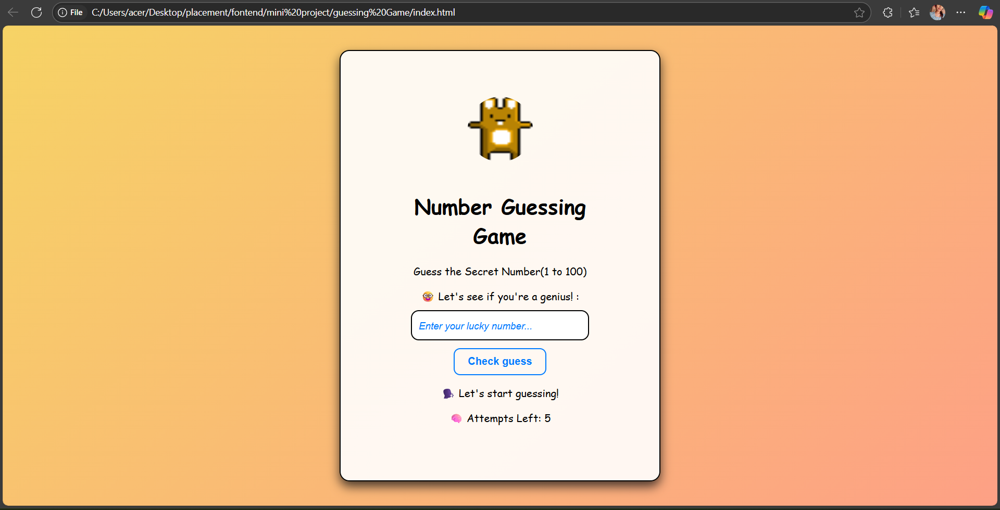

# 🎲 Number Guessing Game

A simple and fun number guessing game built with **HTML, CSS, and JavaScript**. The user has to guess a number between 1–100 in 5 attempts, with emoji feedback and a reset button.

---

## 🚀 Live Demo
👉
[Watch the Demo Video](https://vanshi9027.github.io/number-guessing-game/assets/demo.mp4)

👉 [GitHub Repo](https://github.com/vanshi9027/number-guessing-game)

---

## 📸 Screenshots
### 🎮 Initial UI

### 🏆 Win Screen

---

## 💡 Features
- Generates random number from 1 to 100
- Only 5 guesses allowed
- Win/Lose emoji messages
- “Try Again” resets the game

---

## 🧠 What I Learned
- Rebuilt my JS concepts from scratch (variables, functions, events)
- Worked with `Math.random()` and `Math.floor()` to create logic
- DOM Manipulation using `querySelector`, `textContent`, etc.
- Basic project structuring and file linking

---

## 🔧 Tech Stack
- HTML5
- CSS3
- JavaScript (Vanilla)

---

## 📅 Part of My Challenge
This is **Project 1** of my 30-Day JavaScript Mini Project Challenge (May 2025)

---

## 📜 Author
👨‍💻 [Vanshika Pal](https://linkedin.com/in/vanshika-pal-86425431/)
